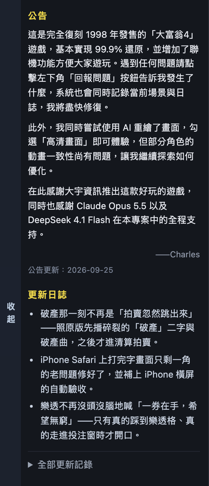

# 大富翁4 高清重制版

原版《大富翁4 超时空之旅》(v3.11, 2001) 的跨平台重制：确定性引擎 + 原生桌面 + 联机对战。

开发计划与全部硬性约束见 [`../DEVELOPMENT_PLAN.md`](../DEVELOPMENT_PLAN.md)。

> **接手的人先读 [`docs/handoff.md`](docs/handoff.md)** —— 未干完的活、方法论铁律、
> 反汇编速查、环境坑，都在那一份里。

## 素材来源

> ⚠️ **本仓库是 code-only 公开镜像：不含任何原版素材，也没有 Git LFS。**
> 所以 clone 下来**不能直接跑** —— 先自备原版《大富翁4 超时空之旅》v3.11 的安装目录
> （`assets/game/`：7 个 `.mkf` + 配乐），按 [`docs/assets.md`](docs/assets.md) 摆好。

桌面版同样**不附带**素材：`bundle.resources` 已从 `tauri.conf.json` 去掉，
打包出来的 `.app` 在运行时读取外部目录（玩家自备目录模式，
见 DEVELOPMENT_PLAN.md §5.6 的 C-LEG-2 / C-LEG-3）。

原作版权归 **大宇资讯 / 软星科技** 所有。

## 界面预览



只有我们**自己**的 DOM 面板（左侧细籤 + 公告 + 亮点 + 收起的更新日誌）：
重制版是**运行时渲染原版素材**的，任何游戏内截图都必然带原版美术，故不在此展示。

## 跑起来

```bash
pnpm install

# 浏览器里玩（开发最快）
pnpm dev                       # → http://localhost:5180
#   可选参数：?humans=1&ai=3&map=0&seed=7&chars=0,3,5,7

# 打一个桌面版（素材自备，产物不含游戏数据 —— 见上）
pnpm --filter @rich4/desktop build
#   产物：packages/desktop/src-tauri/target/release/bundle/macos/大富翁4 重制版.app
```

## 开发

```bash
pnpm install
pnpm test        # 跑测试
pnpm typecheck   # 类型检查
pnpm lint        # 约束检查（含确定性规则强制）
pnpm check       # 以上全部
```

## 致谢

本项目的可行性完全建立在 **Iru Cai (mytbk)** 及协作者自 2018 年起的大富翁4 逆向工程之上：
- https://github.com/mytbk/rich4 (GPL-3.0-or-later)
- https://codeberg.org/vimacs/rich4_asm

本项目同样采用 **GPL-3.0-or-later**。
